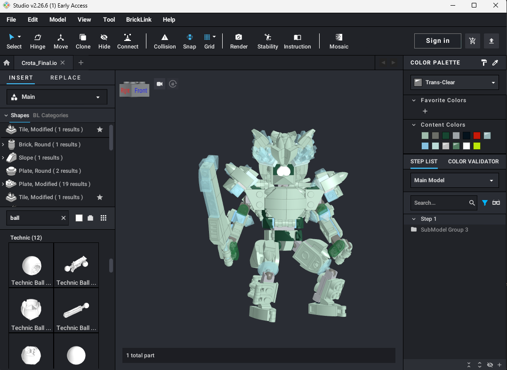
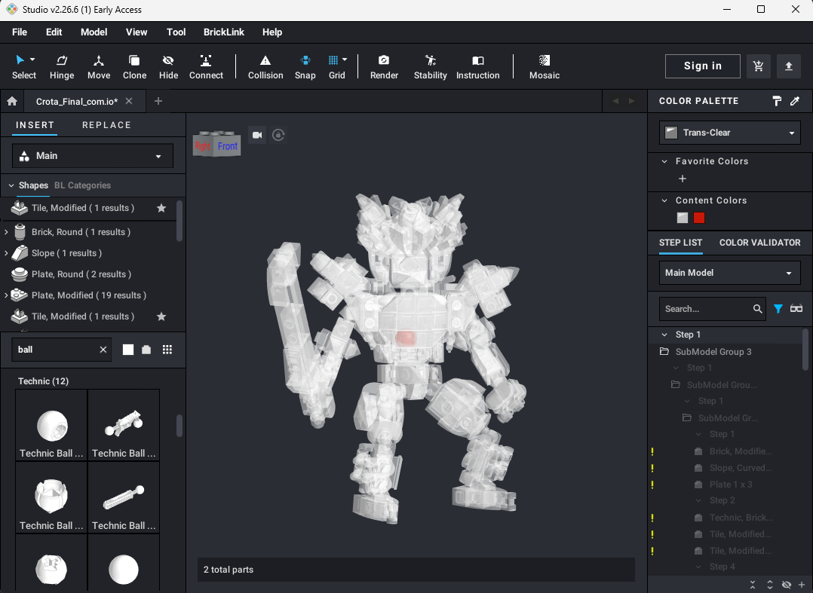

# Studio Center of Mass Calculator

This small C# console tool takes in a 3D LEGO [BrickLink Studio](https://www.bricklink.com/v3/studio/download.page) `.io` model, calculates its center of mass, and writes a new `.io` file with a red technic ball (part 32474) marking the balance point.

The project was created out of a need to understand the weight distribution of a personal project and has no affiliation with the LEGO or Bricklink corporations.

This program is designed to be accessible for people with little technical experience.

## Example

<table>
  <tr>
    <td align="center"><b>Before</b><br/></td>
    <td align="center"><b>After</b><br/>(Note: Parts were made transparent manually)<br/>red technic ball (32474) at center of mass</td>
  </tr>
  <tr>
    <td></td>
    <td></td>
  </tr>
</table>

<p align="center">
  <b>Marker part:</b> technic ball (32474)<br/>
  
</p>

## What it does

1. Unpacks the `.io` file (it is a ZIP archive)
2. Reads part positions from the extracted `model2.ldr`
3. Fetches each part's weight and dimensions from the [BrickLink Catalog API](https://www.bricklink.com/v3/api.page) (They are not included in the .io file)
4. Computes the center of mass
5. Copies the model, inserts a red technic ball (`32474`) at the CoM, and updates `.info`
6. Repacks everything into a new `.io` file (default: `<input>_com.io`)

## Requirements

- BrickLink API credentials [Registrater for Free](https://www.bricklink.com/v2/api/register_consumer.page) and add them to .env
- No terminal or .NET install needed to run the app in `dist/`

## Project layout

```
Studio_Center_of_Mass/
├── assets/
│   ├── Before_CoM.png          # readme screenshots
│   ├── After_CoM.png
│   └── technic_ball.jpg
├── dist/
│   ├── StudioCenterOfMass.exe  # standalone app (no .NET install needed)
│   └── DropHere.bat            # DRAG YOUR .IO FILE ON TOP OF THIS FILE TO START PROGRAM
├── .env                        # FILL IN YOUR BRICKLINK KEYS HERE
├── src/
│   ├── Program.cs              # main pipeline, LDraw parsing, CoM math
│   └── BrickLink/
│       └── BrickLink.cs        # BrickLink API, OAuth, .env loading
└── samples/
    └── brick_test.io           # example model for testing
```

Both source files use `namespace StudioCenterOfMass;`, so they compile into one program. You do not import `BrickLink.cs` manually — `dotnet` includes every `.cs` file in the project.

## Setup

1. Register for BrickLink API access at [bricklink.com/v3/api.page](https://www.bricklink.com/v3/api.page) using the 0.0.0.0 IP option

2. Find the .env file in the project root:

```env
BRICKLINK_CONSUMER_KEY=your_consumer_key
BRICKLINK_CONSUMER_SECRET=your_consumer_secret
BRICKLINK_TOKEN_VALUE=your_token_value
BRICKLINK_TOKEN_SECRET=your_token_secret
```

3. Paste in the values from the BrickLink API access token you created in step 1

## Run

**Simple (no terminal):** drag a `.io` file **onto** `dist\DropHere.bat` (not into the folder). The output is saved next to the input as `<name>_com.io`. Open that file in Studio to see the red ball.

**Optional (terminal):** from the project root:

```powershell
dotnet run -- "path_to_your_io_file"
```

Example output:

```
Studio Center of Mass Calculator
----------------------------------------
  Input:  brick_test.io
  Output: brick_test_com.io

  Unpacking model...
  Looking up 4 part types on BrickLink...
      3003     1.35 g   2×2×1 studs/bricks
      3004     0.83 g   1×2×1 studs/bricks
      3001     2.32 g   2×4×1 studs/bricks
      32474    0.42 g   0×0×0 studs/bricks
  Calculating center of mass...

  Result
    Center of mass: (0.000, -12.000, -16.701) LDU
    Total mass:     5.85 g (4 parts)

  Writing output...
  Done.
    ...\brick_test_com.io
```

## How center of mass is estimated

- **Weight** comes from BrickLink (grams).
- **Local center of mass** is approximated from BrickLink stud dimensions (volume): the part origin is at the top of the studs (LDraw +Y points down), so CoM is placed halfway down the part height.
- **Plates** use height 8 LDU when BrickLink reports `dim_z = 0`. Bricklink's smallest z value is 1, which represents the height of a standard brick (24 LDU)
- **World position** applies each part's rotation matrix and placement from `model2.ldr`.

This is a practical estimate, not a full mesh/volume simulation. Unusual shapes may be slightly off. However, after testing with several of my personal models, it
seems fairly accurate to reality. Please update me with any issues/ succesful tests!

## Potential future improvements

Multithreading to allow for parallel API requests (Should be implemented in a way which does not overload Bricklink infrastructure)

Frontend site

## For developers: rebuilding the exe

After changing the source code, rebuild the standalone exe from the project root:

```powershell
dotnet publish -c Release -r win-x64 --self-contained true -p:PublishSingleFile=true -p:DebugType=None -o dist
```

Requires the [.NET 8 SDK](https://dotnet.microsoft.com/download). Commit the updated `dist\StudioCenterOfMass.exe` along with your source changes.

`bin/` and `obj/` are build output from `dotnet build` / `dotnet publish`. They are gitignored and not needed to run the app.
